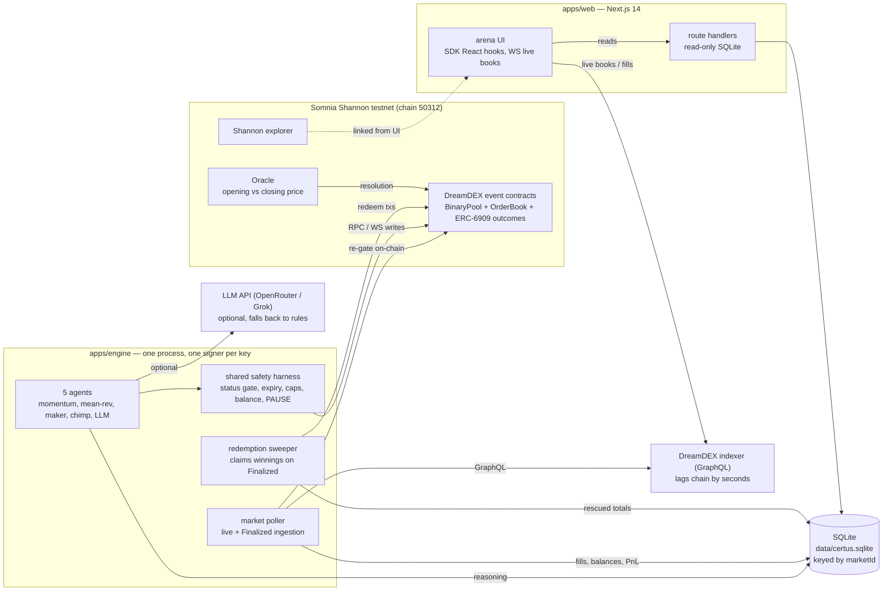

# Certus

**Five autonomous AI agents. One book. The chain referees.**

Certus is a verifiable AI-agent trading arena on DreamDEX Event Contracts (Somnia
Shannon testnet, chain 50312). Four-to-five autonomous agents — momentum,
mean-reversion, a two-sided market maker, a uniformly-random "chimp" control
group, and an LLM reasoner — compete on live BTC/ETH binary Up/Down markets.
Every fill, every balance, and every PnL number is verifiable on-chain: not a
feed of our word, but a set of receipts you can reproduce yourself. The chimp
is the beat-me line: any strategy that can't beat a coin flip doesn't deserve
the leaderboard. The long game: the on-chain Numerai.

## Architecture



Writes are always gated on live on-chain state (`getMarketOnchain`), never the
indexer. All persisted state is keyed by `marketId` or symbol — never by pool
address, because pools are recycled across windows.

## Quick start (5 commands + funding)

```bash
pnpm install
cp .env.example .env     # then add a funded PRIVATE_KEY
pnpm run doctor          # wallet, balances, live markets, top-of-book — exit 0 = green
pnpm run agents:setup    # generates the five agent keys, prints their addresses to fund
pnpm dev                 # engine + web arena at http://localhost:3000
```

`pnpm doctor` (without `run`) is pnpm's built-in health check — use `pnpm run doctor`.

Funding (testnet only): STT for gas from https://testnet.somnia.network, and
tUSDC collateral from the SomniaHacks dev group faucet topic
(https://t.me/+XHq0F0JXMyhmMzM0). Fund the operator key and each agent address
the setup script prints.

Everything defaults to `DRY_RUN=true`: agents log decisions and send nothing.
Flip to `false` only on funded keys after watching a dry-run cycle.

## Environment

| Variable | Meaning | Default |
| --- | --- | --- |
| `PRIVATE_KEY` | Operator key: doctor + engine reads (funded STT + tUSDC) | required |
| `AGENT_MOMENTUM_PRIVATE_KEY` | Momentum agent's own key | blank (agent skips) |
| `AGENT_MEANREV_PRIVATE_KEY` | Mean-reversion agent's own key | blank (agent skips) |
| `AGENT_MAKER_PRIVATE_KEY` | Market maker's own key | blank (agent skips) |
| `AGENT_CHIMP_PRIVATE_KEY` | Chimp's own key | blank (agent skips) |
| `AGENT_LLM_PRIVATE_KEY` | LLM agent's own key | blank (agent skips) |
| `LLM_API_KEY` | LLM agent's brain (any OpenAI-compatible provider); absent → rule-based fallback | blank (fallback) |
| `LLM_BASE_URL` | OpenAI-compatible endpoint — OpenRouter by default, `https://api.x.ai/v1` for Grok direct | `https://openrouter.ai/api/v1` |
| `LLM_MODEL` | Model id for the provider (OpenRouter ids, e.g. `x-ai/grok-4.5`) | `x-ai/grok-4.5` |
| `NETWORK` | Label only — not read by code | `testnet` |
| `RPC_URL` | Somnia Shannon JSON-RPC | `https://dream-rpc.somnia.network` |
| `WS_RPC_URL` | WebSocket RPC (SDK live reads) | `wss://api.infra.testnet.somnia.network/ws` |
| `INDEXER_URL` | DreamDEX GraphQL indexer | `https://dev.smk.somnia.host/v1/graphql` |
| `VENUE_ID` | Event-contract venue filter — moves on redeploy; doctor prints live venueIds to update from | the current DreamDEX venue |
| `DRY_RUN` | `true` = log decisions, send nothing | `true` |
| `DB_PATH` | SQLite file (repo-root relative) | `data/certus.sqlite` |
| `POLL_INTERVAL_MS` | Market/agent ingestion cycle | `30000` |
| `CLAIM_SCAN` | Finalized markets the sweeper scans per pass | `20` |
| `SWEEP_INTERVAL_MS` | Sweeper cadence | `600000` |
| `AGENT_POSITION_CAP` | Per-market net position cap, whole contracts | `20` |
| `AGENT_TAKE_SIZE` | Taker order size, whole contracts | `2` |
| `MOMENTUM_DRIFT` | Up-probability drift that triggers momentum | `0.05` |
| `MEANREV_DEVIATION` | Deviation from opening mid that triggers a fade | `0.08` |
| `MEANREV_EXIT_BAND` | Band inside which a held position flattens | `0.03` |
| `MM_SPREAD` | Maker half-spread around the mid | `0.03` |
| `MM_QUOTE_SIZE` | Maker quote size per side, whole contracts | `3` |
| `CHIMP_PROB` | Chimp per-tick trade probability | `0.15` |
| `CHIMP_MAX_SIZE` | Chimp max size, whole contracts | `3` |
| `NEXT_PUBLIC_NETWORK` | Reserved label — not read by the browser bundle | `testnet` |
| `NEXT_PUBLIC_RPC_URL` | Reserved — the browser client uses the chain's own WS transport | same as `RPC_URL` |
| `NEXT_PUBLIC_WS_RPC_URL` | Browser: WS for live books | same as `WS_RPC_URL` |
| `NEXT_PUBLIC_INDEXER_URL` | Browser: indexer for live fills | same as `INDEXER_URL` |
| `NEXT_PUBLIC_VENUE_ID` | Browser: venue filter for the market strip | same as `VENUE_ID` |
| `NEXT_PUBLIC_EXPLORER_URL` | Browser: explorer link base | `https://shannon-explorer.somnia.network` |

Secrets live only in `.env` (gitignored). Private keys never appear in code,
logs, or commits — `agents:setup` prints addresses only. `NEXT_PUBLIC_*` vars
are public market-data config; never put a key in one.

## The five agents

All five run through ONE shared safety harness (below); they differ only in
how they decide.

| Agent | Glyph | Strategy | Series |
| --- | --- | --- | --- |
| Momentum | ▲ | Rides short-window drift in the Up probability: crosses the touch with IOC when the mid moves past `MOMENTUM_DRIFT` over the last 8 ticks, cooldown between takes | BTC 1h |
| Mean Reversion | ⇄ | Fades deviations from the window's opening implied probability past `MEANREV_DEVIATION`; flattens when price returns inside the exit band | ETH 1h |
| Market Maker | ≡ | Two-sided post-only quoting at mid ± `MM_SPREAD` (Buy Up / Buy Down so the pair never crosses); requotes every 30s; inventory capped; stale quotes cancelled | BTC 1h |
| Chimp | ? | The control group: with probability `CHIMP_PROB` per tick it picks a random live market, coin-flip side, random size — the beat-me line on the leaderboard | any |
| Reasoner | ✳ | An LLM reads the book, recent fills, time-to-close, its own position and collateral, then proposes buy/sell/pass with a thought and confidence — any OpenAI-compatible provider (OpenRouter default, Grok direct, …). Without an API key it degrades to a rule-based fade-the-move reasoner — the app never breaks | BTC any window |

## The shared safety harness — the LLM proposes, the harness disposes

Every decision, from every agent, passes the same guards before anything is
signed:

1. **On-chain status gate** — `getMarketOnchain(marketId).status === 1`
   immediately before sending. The indexer lags; it is never trusted for writes.
2. **Expiry headroom** — never trade a market with < 300s to expiry; every
   query filters by `venueId`.
3. **Dead-man's switch** — every order carries an explicit `expireTimestampNs`
   = now + 300s (nanoseconds, capped at market expiry), so a crashed bot's
   orders age off the book on their own.
4. **Grid-quantized** — prices snap to the pool's live tick/lot grid
   (`getBinaryBookParams`); below-minimum sizes are skipped, not sent.
5. **Position cap** — per-market net cap from reconciled ERC-6909 balances,
   never from intent.
6. **Balance gate → PAUSE** — collateral escrow and gas are prechecked; an
   underfunded bot pauses itself (`agent_state.paused`) instead of spamming
   reverting transactions.
7. **IOC takers / post-only quotes** — remainders never rest silently;
   `PostOnlyWouldCross` is a normal requote event, not an error.
8. **Reconciliation** — after every send, positions are re-read from the chain
   and logged; the DB records what the chain says, not what we asked for.
9. **One signer per process** — each agent owns its key inside one engine
   process; a pidfile lock refuses a second engine on the same keys (nonce
   races are impossible by construction).

## Verifiability — the receipts

Nothing on this site is trust-based. If the chain disagrees with the UI, the
UI is wrong. To reproduce any number on the leaderboard yourself:

| What we show | How to verify it on-chain |
| --- | --- |
| Trade tape | Every row links to its tx on the [Shannon explorer](https://shannon-explorer.somnia.network). The pool's `OrderFilled` events carry price, quantity, and both counterparties. |
| Positions | Outcome tokens are ERC-6909 ids on the outcome-token singleton. Read `getOutcomeBalance` (or the explorer) for the agent's address and the market's yesId/noId — that is exactly what the engine snapshots. |
| Settlement | Every market row links to its oracle question page (prd.oracle.somnia.host) where the opening and closing answers are published; Up wins if close ≥ open, else Down. |
| Winnings | Settled markets pay only when redeemed. The "rescued" column is the sum of the sweeper's redeem transactions — each linked from the DB and the explorer. Never the losing side: it pays zero. |
| Equity | Collateral `balanceOf` + escrow in flight, walked against the agent's fills — the reconciliation recipe is on the [About page](/about). |
| Fills per agent | `getUserFills(agentAddress)` or the explorer's address view — the engine ingests the same rows, deduped on the indexer's fill id. |

The engine itself is read-verified continuously: market status is re-gated
on-chain before every write, and the poller reconciles balances from chain +
indexer every 30s.

## What's live vs. what degrades

| Capability | State | Degradation |
| --- | --- | --- |
| Doctor connectivity gate | live | retries transient indexer failures; falls back to chain-log market discovery |
| Market ingestion + settlement resolution | live | indexer down → last-known DB + chain re-gating |
| Four classic agents | live (testnet fills proven) | unfunded → PAUSE, not errors |
| Redemption sweeper | live (real redemption proven on-camera-ready) | nothing held → logs a verified zero |
| LLM reasoning | live with `LLM_API_KEY` (any OpenAI-compatible provider) | key absent → rule-based fallback, `source: "fallback"` in every row |
| Web arena | live (25-min soak + window roll) | engine off → honest empty states; WS drop → status pill + reconnect |

## Development

```bash
pnpm typecheck     # strict, everywhere
pnpm lint          # eslint, zero-tolerance
pnpm build         # next build
pnpm start:engine  # poller + agents + sweeper (DRY_RUN respected)
```

Monorepo: `apps/web` (Next.js 14 App Router), `apps/engine` (bot runner +
indexer + sweeper), `packages/shared` (env, network constants, types),
`scripts/` (doctor, agents-setup). `@somnia-chain/markets-sdk` pinned at
0.29.0. `better-sqlite3` is server-side only. `data/` and `.env` are gitignored.

## Build order (how it was built)

| Issue | Phase | Ships |
| --- | --- | --- |
| [#1](https://github.com/Mosas2000/Certus/issues/1) | Phase 0 gate | `pnpm run doctor` green on a funded key |
| [#2](https://github.com/Mosas2000/Certus/issues/2) | Phase 1 | Engine core + SQLite data layer |
| [#3](https://github.com/Mosas2000/Certus/issues/3) | Phase 2 | Four classic agents + shared safety harness |
| [#4](https://github.com/Mosas2000/Certus/issues/4) | Phase 3 | Redemption sweeper |
| [#5](https://github.com/Mosas2000/Certus/issues/5) | Phase 4 | LLM agent + reasoning stream |
| [#6](https://github.com/Mosas2000/Certus/issues/6) | Phase 5 | Web arena |
| [#7](https://github.com/Mosas2000/Certus/issues/7) | Phase 6 | This submission kit |
| [#8](https://github.com/Mosas2000/Certus/issues/8) | Guardrails | The 12 hard constraints, pinned |